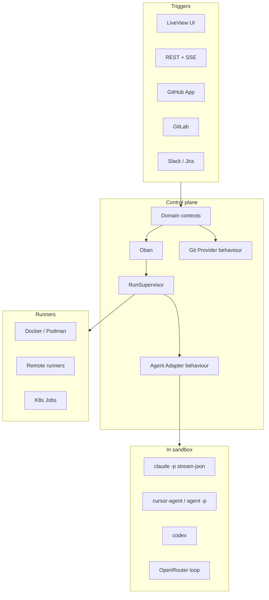

# AgentYard — Product & Technical Concept (v2)

**Working name:** AgentYard (placeholder; swap freely)
**Author context:** Concept for Dominic Letz (Berlin).
**Status:** v2 draft — research-informed; visual prototypes in `prototype/`.
**Path:** `/workspace/self-hosted-agents-concept/CONCEPT.md`

### Changelog

| Version | Date | Notes |
|---------|------|-------|
| **v2** | 2026-09-24 | Sharpened positioning vs OpenHands; greenfield Elixir recommendation folded into architecture/MVP; added **Key screens**; moved OpenHands + Elixir deep dives to `appendix/`. Placeholder name → **AgentYard**. |
| v1 | 2026-09-24 | Initial research concept (Cursor / Anthropic / OpenHands / Elixir landscape). |

---

## 1. Summary

Teams on GitHub or GitLab want Cursor-style *cloud agents* and Anthropic-style *managed agents*—async coding agents that clone a repo, work in isolation, stream progress, and open a PR/MR—but on **their own infra**, with **their own keys**, and **pluggable agent CLIs** (Claude Code, Cursor CLI, Codex, OpenRouter-backed loops).

**AgentYard** is a proposed **open-source, self-hosted Elixir/Phoenix control plane**: team web UI, REST + streaming API, first-class GitHub **and** self-managed GitLab, Slack/Jira triggers, and a behaviour-based adapter layer for headless agent CLIs—under a **permissive license** (Apache-2.0 recommended), without gating team/RBAC/SSO features behind a PolyForm trial.

**Why not just OpenHands?** OpenHands (MIT Agent Canvas) is the closest OSS platform and covers a lot for single-user / small-team use. The gap AgentYard targets is **team-ready self-host under OSI terms**: multi-user orgs, RBAC, SSO, self-managed GitLab, Slack/Jira, first-class **Cursor CLI** alongside Claude Code + OpenRouter, EU-hostable packaging—capabilities that today largely sit in OpenHands **Cloud/Enterprise (commercial / PolyForm Free Trial)**, not the MIT path. See `appendix/openhands-deep-dive.md`.

**Build approach:** **Greenfield Phoenix** control plane. Reuse **jido_harness** / Hex Claude SDKs for CLI adapters; borrow UX ideas from Camelot, tracker/workspace patterns from OpenAI Symphony, HITL/cost/worktree ideas from CodeLead—**do not fork** those products (license/product-fit issues). See `appendix/elixir-prototypes-review.md`.

---

## 2. Problem and target users

**Problem:** Commercial cloud agents excel at async coding, but many teams need data/key residency, GitLab self-managed parity, multi-CLI choice, and shared team ops (history, cost, RBAC)—without renting a US SaaS sandbox or accepting source-available enterprise gates.

**Users:** Eng teams (10–200+) on GitHub/GitLab; Platform/DevEx owners; compliance-sensitive orgs (BYO LLM keys OK, third-party code hosting not); indie teams wanting Compose-up self-host.

**Non-goals (initially):** replacing IDEs; training models; full IDE-in-browser; SWE-bench research harness.

---

## 3. Landscape and positioning (short)

| | Cursor Cloud | Claude Managed Agents | OpenHands OSS | OpenHands Ent | **AgentYard** |
|--|--------------|----------------------|---------------|---------------|---------------|
| Self-host control plane | Partial (workers) | Self-host sandbox option | Yes (1-user Canvas) | Yes | **Yes, team-first** |
| Multi-user RBAC / SSO | Team SaaS | API/org | **No** | **Yes** | **Yes (OSS)** |
| Claude Code | — | Native | ACP | Yes | Adapter |
| Cursor CLI | Native (their agent) | — | **No** | No | **Adapter** |
| OpenRouter | — | — | Yes | Yes | **Yes** |
| GitLab self-managed | Yes | Weak | Weak / DIY | **Yes** | **Yes (OSS)** |
| Slack / Jira | Slack / Linear etc. | — | Partial / Cloud | Yes | **OSS roadmap** |
| License | Proprietary | Proprietary | MIT | PolyForm trial | **Apache-2.0 (+ commercial add-ons)** |

**One-liner:** *Self-hosted team control plane for coding agents—GitHub & GitLab, BYO CLIs & keys, Elixir ops, fully open team features.*

---

## 4. Domain model

| Concept | Definition |
|---------|------------|
| **Team** | Tenant: members, roles, SSO, cost pools, default policies. |
| **Repository** | Linked GitHub/GitLab project; env setup; triggers; repo-scoped secrets. |
| **Agent Provider** | Adapter id: `claude_code`, `cursor_cli`, `codex_cli`, `openrouter_loop`, … |
| **Agent Profile** | Provider + model + instructions + permission mode + budget + env defaults. |
| **Environment** | Dockerfile / install / start; network egress; resource limits. |
| **Session** | Durable conversation (follow-ups). |
| **Run** | One execution: prompt, profile, ref, sandbox, status, usage, artifacts. |
| **Trigger** | `ui` \| `api` \| `github_comment` \| `gitlab_comment` \| `slack` \| `jira` \| `schedule`. |
| **Artifact** | Branch, PR/MR, logs, diffs, usage. |
| **Secret** | Team/repo/profile scoped; encrypted; injected at start; never logged raw. |

---

## 5. Architecture

Phoenix **control plane** + pluggable **runners** + Git provider layer + agent adapters.

**Stack:** Phoenix + LiveView; Oban; OTP per-run supervision; MuonTrap/erlexec for CLIs; Docker MVP → remote runners/K8s later; Tentacat/Req for GitHub/GitLab; Ecto/Postgres; Cloak (or equiv) for secrets; Telemetry.

**Adapter reuse:** Prefer **jido_harness** (Apache-2.0) and/or Hex **claude_agent_sdk** / **claude_code** for Claude Code wire protocol; implement Cursor/Codex/OpenRouter adapters behind the same Elixir behaviour. Do not fork Camelot (GPL-2.0), CodeLead (ELv2), or Symphony (Codex-preview reference only).

---

## 6. Agent adapters (sketch)

Behaviour: `prepare/1`, `start/1`, `follow_up/2`, `cancel/1`, event normalizer → `{status, assistant_delta, tool_call, tool_result, usage, result, error, done}`.

| Provider | Headless | Auth |
|----------|----------|------|
| Claude Code | `claude -p` + `stream-json` | `ANTHROPIC_API_KEY` / setup-token |
| Cursor CLI | `agent -p` + stream-json | `CURSOR_API_KEY` |
| Codex | `codex exec` / app-server (verify flags) | OpenAI / Codex key |
| OpenRouter | Thin loop or Aider/opencode pointed at OpenRouter | `OPENROUTER_API_KEY` |

---

## 7. Key user flows

1. UI → New run → live session → PR/MR.
2. API → create session/run → SSE → follow-up / cancel.
3. `@agentyard` on GitHub/GitLab issue/MR → run → bot opens PR/MR + comments.
4. Slack / Jira (post-MVP) → same session model.
5. Human reviews PR/MR in the forge.

---

## 8. Security

Per-run container; egress allowlist; secrets encrypted + scoped; short-lived forge tokens; safer permission profiles by default; single-tenant Compose first.

---

## 9. Open-source strategy

**Apache-2.0** core + adapters; commercial **Enterprise** add-ons (HA support, advanced audit exports, managed hosting)—**not** gating basic multi-user/RBAC/SSO behind PolyForm. Packaging: Docker Compose day-one; Helm later.

---

## 10. MVP and roadmap

### MVP (single-node)

- LiveView: **Runs**, **New run**, **Run detail**, **Repos**, **Profiles**, **Team settings** (members/roles, secrets, GitHub+GitLab).
- REST + SSE.
- GitHub App + GitLab (incl. self-managed).
- Docker sandbox; env Dockerfile/install script.
- Adapters: **Claude Code**, **Cursor CLI**, **one OpenRouter path**.
- Compose + docs.

### Later

- Slack + Jira triggers; remote runners / Helm; SSO/SAML hardening; Codex adapter; Firecracker/stronger isolation; optional EU managed tier.

---

## 11. Key screens

Visual prototypes: `prototype/*.html` (sample data: team **Acme**).

| # | Screen | Purpose | Main elements | Primary actions |
|---|--------|---------|---------------|-----------------|
| 1 | **Runs overview** | Team-wide pulse of sessions/runs | Table/cards: status, repo, agent profile, trigger (UI/GitHub/GitLab/Slack/API), cost, time; filters | New run; open run; filter by repo/status/agent |
| 2 | **New run** | Compose an async coding job | Repo + base branch, agent profile, prompt, optional issue link, env override, auto-PR toggle | Start run; save as draft profile |
| 3 | **Run detail** *(hero)* | Watch, steer, finish | Timeline of agent events; tool calls; terminal; file diff; follow-up box; stop; PR/MR link; tokens/cost | Follow-up; Stop; Open PR/MR; copy branch |
| 4 | **Repository** | Configure how agents work on one repo | Forge connection; Dockerfile/install/start; default profile; triggers (@mention, label); repo secrets | Save env; test build; rotate secrets |
| 5 | **Agent profiles** | BYO providers and policies | List of profiles; provider (Claude Code / Cursor / Codex / OpenRouter); model; instructions; permission mode; key status | Create/edit profile; validate CLI |
| 6 | **Team settings** | Org governance | Members/roles; SSO; secrets vault; integrations (GitHub App, GitLab, Slack, Jira); audit log | Invite; connect integration; rotate vault key |

Optional later screens: Environment build history; Usage/cost dashboards; Automation/schedule editor.

---

## 12. Open questions for Dominic

1. Confirm **AgentYard** vs ForgePad/GitYard.
2. Accept **greenfield** (vs contributing to Camelot under GPL)?
3. MVP must include **self-managed GitLab** day-one, or GitHub-first then GitLab?
4. SSO in MVP or milestone 2?
5. OpenRouter path: thin built-in loop vs wrap Aider/opencode?
6. Hosted EU tier in parallel with OSS, or self-host only first?
7. Branding constraints vs “Claude Code” (Anthropic: prefer “Claude Agent” in UI).

---

## Appendix index

| Doc | Contents |
|-----|----------|
| [`appendix/openhands-deep-dive.md`](appendix/openhands-deep-dive.md) | License, company, Cloud/residency, EU managed hosts (none found), GitLab/Slack/Jira, secrets |
| [`appendix/elixir-prototypes-review.md`](appendix/elixir-prototypes-review.md) | Ankole, Camelot, CodeLead, Symphony, Harness, TurboKanban, jido_harness; matrix vs OpenHands; greenfield recommendation |
| [`prototype/`](prototype/) | HTML mockups + PNG screenshots |
| [`FEATURES.md`](FEATURES.md) / [`FEATURES.csv`](FEATURES.csv) | Full feature catalog (259 features, 19 categories) across all references, with AgentYard priorities and differentiators |

### Primary sources (short)

- Cursor Cloud Agents / API / CLI: https://cursor.com/docs/cloud-agent , https://cursor.com/docs/cloud-agent/api/endpoints , https://cursor.com/docs/cli/headless
- Claude Managed Agents / Agent SDK / CLI: https://platform.claude.com/docs/en/managed-agents/overview , https://code.claude.com/docs/en/agent-sdk/overview , https://code.claude.com/docs/en/cli-reference
- OpenHands: https://github.com/OpenHands/OpenHands , https://www.openhands.dev/pricing , https://docs.openhands.dev/enterprise/enterprise-vs-oss
- Elixir: https://github.com/openai/symphony , https://github.com/T0ha/camelot , https://github.com/agentjido/jido_harness , https://github.com/AgentBull/ankole
